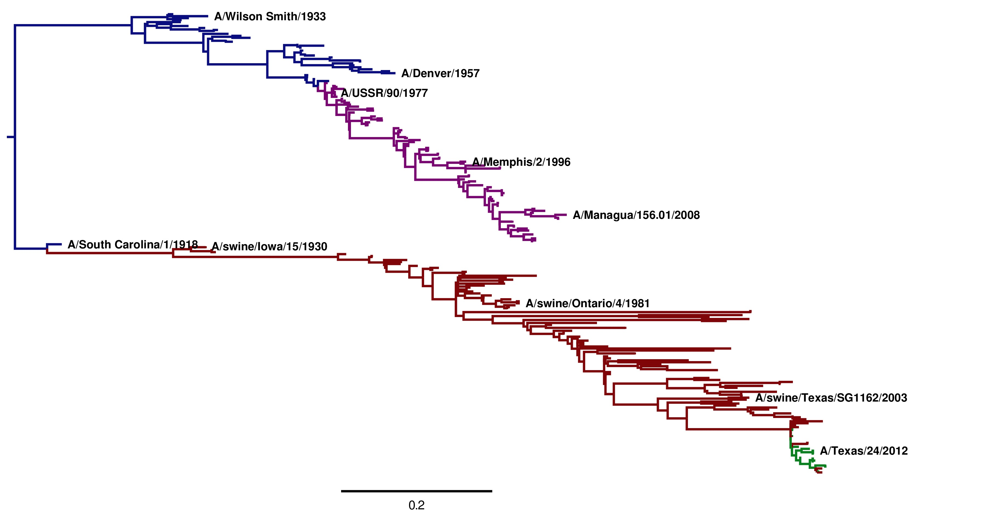
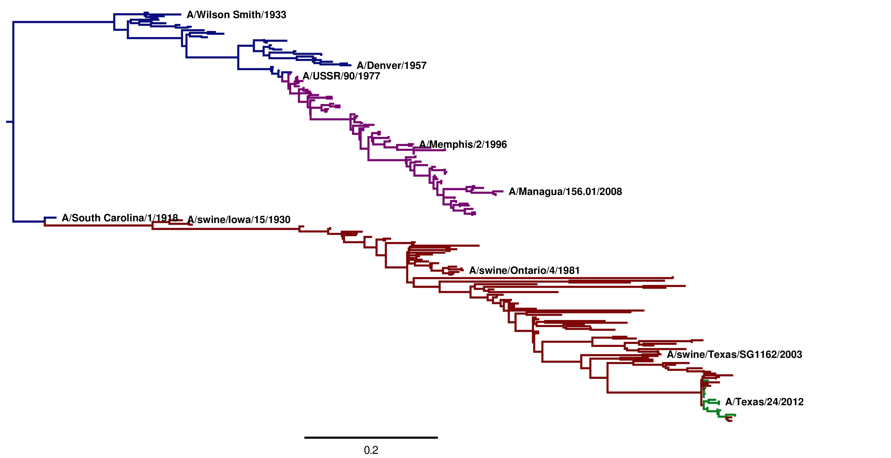
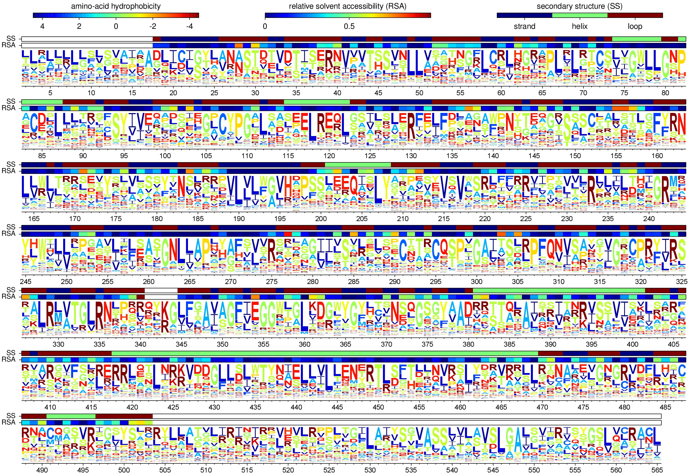
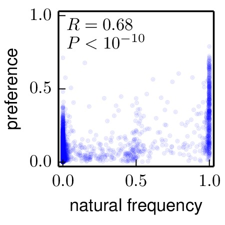

=============================================================
2014 analysis of H1 influenza HAs descended from 1918 virus
=============================================================

.. contents::
   :depth: 3

This is a description of the analysis in `The inherent mutational tolerance and antigenic evolvability of influenza hemagglutinin`_.

Overview
------------
This is an analysis of influenza A virus H1 hemagglutinins (HAs) from human and swine that are descended from a common ancestor closely related the HA of the 1918 virus. This analysis constructs phylogenies of these sequences and analyzes them with standard and experimentally determined codon substitution models.

This analysis was performed by `Jesse Bloom`_.

Much of the analysis itself is performed using `HYPHY`_, which is run by `phyloExpCM`_ using the scripts detailed in the `phyloExpCM documentation`_. 

The code, data, and results from the analysis are in the ``./examples/2014Analysis_Influenza_H1_HA/`` subdirectory in the main `phyloExpCM`_ package directory. This subdirectory contains the necessary input files (see `Input files`_) for running the analysis. It also contains a master script (``run_analysis.py``) that can be used to regenerate the analysis with the command::

    python run_analysis.py

provided that you have installed the software described in `Software used`_.

Software used
----------------
The analysis was performed using the following software on the Fred Hutchinson computer cluster using the following Linux distribution::

    Linux version 3.5.0-43-generic (buildd@roseapple) (gcc version 4.6.3 (Ubuntu/Linaro 4.6.3-1ubuntu5) ) #66~precise1-Ubuntu SMP Thu Oct 24 14:52:23 UTC 2013

In order to replicate the analysis, you will need to use Linux or Mac OS X, and install the software listed below.

The specific versions of software used are specified. Other versions will likely work as well, but this has not been confirmed.

* `Python`_ (version 2.7.3)

* `phyloExpCM`_ (specifically, `phyloExpCM version 0.32`_).

* `numpy`_ (version 1.6.1)

* `matplotlib`_ (version 1.3.1).

* `mapmuts`_ (specifically, `mapmuts version 1.01`_)

* `Biopython`_ (version 1.5.8)

* `EMBOSS needle`_ (version 6.6.0). The executable with the name ``needle`` is expected to be in the current search path.

* `RAxML`_ (version 7.7.6). The executable with the name ``raxmlHPC-SSE3`` is expected to be in the current search path. This is the SSE3 version, and was built using the command::

    make -f Makefile.SSE3.gcc

  and then copying the executable into the search path.

* `Path-O-Gen`_ (version 1.4) was used for the visual identification of outliers from the molecular clock and to root trees based on date-stamping.

* `FigTree`_ (version 1.4.0) was used to open tree files for annotation, visualization, and saving of images.

* `codonPhyML`_ (version 1.00 201306.18) was used to build phylogenetic trees. The executable with the name ``codonphyml`` is expected to be in the current search path. This executable was compiled with the *omp* options to make it multi-threaded.

* `HYPHY`_ (version HYPHY 2.220131214beta(MP) for Linux on x86_64) was used to optimize the branches and compute the likelihoods under the different models. The multiprocessor (``HYPHYMP``) version of the executable was used. To install this, the following commands were run in the unzipped `HYPHY`_ source code directory after download::

    cmake -DINSTALL_PREFIX=/home/jbloom/.local/ .
    make MP2
    make install

* This analysis was run on the FHCRC scientific computing cluster using `sbatch`_ (version 2.6.2), and requires `sbatch`_ to be installed to run as currently implemented. If you don't want to use `sbatch`_, all you need to do is modify the main ``run_analysis.py`` script to not submit any jobs via `sbatch`_. The use of `sbatch`_ in the current version simply allows more processors to be used simultaneously and so speeds up the analysis.

* `ImageMagick convert`_ 6.6.9-7 2012-08-17 was used to convert PDF files to JPGs.

* `weblogo`_ (version 3.3) was used to make the sequence logo plot.

* `PyPdf`_ (version 1.13) was used to make overlays on the sequence logo plot.

Input files
-----------------------
Here are the input files that are necessary to repeat the analysis. These are the names assigned with the ``./examples/2014Analysis_Influenza_H1_HA/`` subdirectory of the main `phyloExpCM`_ package.

* ``run_analysis.py`` is a `Python`_ script that will perform the analysis assuming that you have all of the appropriate software (see `Software used`_) and input files. To run this script, use::

    python run_analysis.py

  at the command line. 

* ``WSN-HA.fasta`` is the coding DNA sequence for the A/WSN/1933 (H1N1) HA as taken from reverse-genetics plasmid pHW184-HA.

* ``H1_HAseqs.fasta`` is the set of all full-length influenza A HA coding DNA sequences of subtype H1 (excluding lab-adapted strains) as downloaded from the `Influenza Virus Resource`_ on March-29-2014.

* ``parse_H1_HumanSwine.py`` is a `Python`_ scripts that extracts and aligns the HA sequences in ``H1_HAseqs.fasta``

* ``JVI_82_8947_Anomalies.txt`` is a list of the strain names for the sequences identified as anomalous (either frozen in time or recombinant) in Appendices 1 and 2 of `Krasnitz et al, 2008`.

* ``JDB_Anomalies.txt`` is a list of strain names that appear to be anomalous based on their strong violation of the molecular clock. These sequences are probably mis-annotated in the database, come from non-standard lineages (for examples a swine H3N2 isolated from humans), are reassortants, are extensively lab adapted and so deviate from the molecular clock due to large numbers of adaptation mutations, or are simply valid H1N1 sequences that don't fall into the 1918 descended human or swine lineages.

* ``mutationrates.txt`` is a file giving the nucleotide mutation rates for the influenza polymerase as described in `Bloom 2014`_. Specifically, in that reference the mutation rates were determined as:

    - AG, TC : :math:`2.4 \times 10^{-5}`

    - GA, CT : :math:`2.3 \times 10^{-5}`

    - AC, TG : :math:`9.0 \times 10^{-6}`

    - CA, GT : :math:`9.4 \times 10^{-6}`

    - AT, TA : :math:`3.0 \times 10^{-6}`

    - GC, CG : :math:`1.9 \times 10^{-6}`

  There are six experimentally determined mutation rates, but in order for the overall substitution model to be reversible, the mutation rates must satisfy :math:`R_{C \rightarrow T} = \frac{R_{A \rightarrow G} \times R_{C \rightarrow A}}{R_{A \rightarrow C}}` as described in the `phyloExpCM documentation`_ to ``phyloExpCM_OptimizeDetectSelectionHyphy.py``. To satisfy this constraint will conforming to the experimentally measured values, we set the rates for A to C and C to A mutations equal to their average, and the same for A to G and G to A. This seems justified as these pairs of rates are nearly equal in the experimentally determined values. This gives the contents of ``mutationrates.txt``::

    AC 9.2e-6
    AG 2.35e-5
    AT 3.0e-6
    CA 9.2e-6
    CG 1.9e-6

* The site-specific amino-acid preferences for the WSN HA as inferred using `mapmuts`_ and described as part of the `mapmuts analysis of the WSN HA from 2014`_. These are the preferences inferred with the `mapmuts`_ script ``mapmuts_inferpreferences.py``. The specific files are:

    - ``combined_amino_acid_preferences.txt`` : combined data from all three experimental replicates.

    - ``replicate_1_amino_acid_preferences.txt`` : data from first experimental replicate.

    - ``replicate_2_amino_acid_preferences.txt`` : data from second experimental replicate.

    - ``replicate_3_amino_acid_preferences.txt`` : data from third experimental replicate.

* ``./PDB_structure/`` : subdirectory containing the results of analyzing the crystal structure of HA. Specific input files in this directory:

    - ``1RVX.pdb`` is the crystal structure `1RVX`_ (downloaded from the Protein Data Bank) of the HA from A/PR/8/1934 (H1N1). This is the crystallized HA closest in identity to the WSN HA.

    - ``1RVX_trimer.pdb`` is a version of ``1RVX.pdb`` that has been manually edited to contain only one trimer (chains A through F). The original ``1RVX.pdb`` contains two trimers in the asymmetric unit.

    - ``1RVX_trimer_renumbered.pdb`` is a version of ``1RVX_trimer.pdb`` that has been renumbered with `PDB Goodies`_ and so manual touch-up so that the numbering matches sequential 1, 2, ... numbering of the WSN HA sequence. The HA1 and HA2 chains have been merged into single chains (A, B, and C) and these chains are now numbered so that residue *r* corresponds to residue *r* in sequential numbering of the WSN HA sequence. Overall, this renumbered PDB contains 483 residues in each of the three HA chains, of which 438 are exact matches with the corresponding position in the WSN HA protein.

    - ``1RVX_trimer_renumbered.dssp`` is a text file containing the results of running the `DSSP webserver`_ on ``1RVX_trimer_renumbered.pdb`` to determine the secondary structure and solvent accessibility of residues. The residues in this file match sequential 1, 2, ... numbering of the WSN HA protein sequence.

    - ``sequential_to_H3.txt`` is a file that converts between the sequential 1, 2, ... numbering of the WSN HA and the H3 numbering scheme as used in PDB `4HMG`_. This conversion was done using `HA_numbering`_. The file contains comma-separated lines with the first entry giving the sequential number and the second giving the H3 number. For the H3 number, numbers alone indicate the HA1 chain and numbers followed by HA2 indicate the HA2 chain.

Running the analysis
-----------------------
The analysis in this directory can be repeated simply by running the master script ``run_analysis.py`` from the command line with::

    python run_analysis.py

or running it using `sbatch`_ with::

    sbatch run_analysis.sbatch

Other than the files delineated under `Input files`_, all data files in this directory can be re-generated with this command. However, the analysis approach does involve a few manual steps with `Path-O-Gen`_ and `FigTree`_ to create nicely formatted and annotated tree images from the raw tree files produced by the script. These manual steps are indicated below.

There is a variable called *use_existing_output* that is hardcoded into the beginning of this script. This variable is currently set to *True*, which means that if output already exists it is **not** overwritten and regenerated. If you want to regenerate the output (such as after changing input files or altering analysis parameters), then either manually delete the old output or change *use_existing_output* to *False* to force the script to overwrite old output. This script does **not** automatically test for dependencies among files, so if you change a file but keep *use_existing_output* to *True*, then you need to manually remove any old files with dependencies.

Note that ``run_analysis.py`` uses multiple CPUs to speed up some of the analyses. If you don't have as many CPUs on your system, you might want to check that you are not overloading the system -- you can avoid this by using fewer CPUs, which will require you to manually modify the ``run_analysis.py`` script.

Note that ``run_analysis.py`` uses `sbatch`_ by default to run some of its subsidiary programs -- if you don't want to do this, set the *use_sbatch* option to *False* within the program.

Steps in the analysis
---------------------------------------
Here are the steps in the analysis. The command for each step is shown, but most of these commands (with the exception of some manual formatting of tree images with `Path-O-Gen`_ and `FigTree`_) are run automatically by the main ``run_analysis.py`` script if you are using that.

Construction of sequence sets
~~~~~~~~~~~~~~~~~~~~~~~~~~~~~~~~~~~
The first step is construction of alignment of H1 HA sequences. The ultimate set of aligned sequences are in ``aligned_HAs.fasta``.

Parsing and alignment of sequences
+++++++++++++++++++++++++++++++++++++

The alignment is done by the `Python`_ script ``parse_H1_HumanSwine.py`` using the command::

    python parse_H1_HumanSwine.py

Briefly, the script functions as follows:

1) All sequences in ``H1_HAseqs.fasta`` are read, and any sequences defined by anomalous (are listed in ``JVI_82_8947_Anomalies.txt`` or ``JDB_Anomalies.txt``) are removed, as are sequences with ambiguous nucleotides, sequences that are not at least 1695 nucleotides in length, or sequences with headers that cannot be parsed.

2) Of the remaining sequences, only the following are retained:

    - Human H1N1 from 1918 to 1957, and from 1977 to 2014.

    - Swine H1N1 from any year.

3) For these retained sequences, a maximum of three sequences per host and year. The sequences that are retained are the three unique sequences that have the most occurrences in ``H1_HAseqs.fasta`` in that host / year -- the idea here is to avoid picking sequences with outlier mutations. If there are multiple sequences with equal numbers of occurrences, one is chosen randomly.

4) The sequences are pairwise aligned with `EMBOSS needle`_ to the WSN HA (``WSN-HA.fasta``), and any gaps relative to this reference sequence are removed. The retained sequences are written to ``aligned_HAs.fasta``.

Molecular clock analysis for anomalous and off-lineage sequences
+++++++++++++++++++++++++++++++++++++++++++++++++++++++++++++++++++
To identify and remove any anomalous sequences in ``aligned_HA.fasta``, an analysis is performed to make sure the sequences conform reasonably well to the molecular clock. Sequences that don't conform could be misannotated, lab adapted, or (most frequently) are genuine H1N1 that are not from the major lineage (for example, European swine H1N1 or the 1976 Fort Dix swine flu in humans).

All sequences written by ``parse_seqs.py`` to ``aligned_HAs.fasta`` have their date pre-pended.
Human seasonal H1N1 reappeared in 1977 and persisted through 2008. The appearance was due to revival of the human H1N1 from about 1954. The dates for these sequences therefore need to have 24 years substracted in order to conform to a molecular clock (see `dos Reis et al, 2009`_) -- this is done by ``parse_seqs.py``

An analysis for concordance with the molecular clock is performed using `RAxML`_ and `Path-O-Gen`_. Specifically:

1) Build a `RAxML`_ tree (no date stamping) to allow visual inspection for possible outliers, and write this tree to the ``RAxML_output`` subdirectory::

        raxmlHPC-SSE3 -w ./RAxML_output -n aligned_HAs -p 1 -m GTRCAT -s aligned_HAs.fasta

2) The tree was then visually inspected using `Path-O-Gen`_ and `FigTree`_, and clear outliers from the molecular clock were removed by adding them to ``JDB_Anomalies.txt`` and re-running the analysis.

3) This was repeated until there were no further outliers.

4) In addition, sequences that appeared to be one-off zoonotic transfers (i.e. a single avian virus in an otherwise swine lineage, etc) were also added to ``JDB_Anomalies.txt``.

Construction of phylogenetic trees
~~~~~~~~~~~~~~~~~~~~~~~~~~~~~~~~~~~~~~~~~~~~~~~~~~~~~~~~
High-quality phylogenetic trees of the sequences in ``aligned_HAs.fasta`` were constructed using `codonPhyML`_. 
The `phyloExpCM`_ script ``phyloExpCM_runcodonPhyML.py`` (see `phyloExpCM documentation`_ for details) was used to run `codonPhyML`_.  

Two trees were built with two different codon substitution models:

    * The *GY94* codon model (`Goldman and Yang 1994`_) was used with the following setting:
    
        - The equilibrium codon frequencies estimated emprically using the `CF3x4`_ method.

        - A single transition / transversion ratio (*kappa*) estimated by maximum likelihood.

        - The dN/dS ratio (*omega*) drawn from four discrete gamma-distributed categories (`Yang 1994`_) with the shape parameter and mean estimated by maximum likelihood.

      The tree construction was performed in the ``./CodonPhyML_Tree_H1_HumanSwine_GY94/`` subdirectory of the example subdirectory. The tree itself is in the file ``./CodonPhyML_Tree_H1_HumanSwine_GY94/codonphyml_tree.newick``.

    * The *KOSI07* codon model (`Kosiol et al 2007`_) was used with the following setting:
    
        - The equilibrium codon frequencies estimated emprically using the *F* method.

        - A single transition / transversion ratio (*kappa*) estimated by maximum likelihood.

        - The dN/dS ratio (*omega*) drawn from four discrete gamma-distributed categories (`Yang 1994`_) with the shape parameter and mean estimated by maximum likelihood.

      The tree construction was performed in the ``./CodonPhyML_Tree_H1_HumanSwine_KOSI07/`` subdirectory of the example subdirectory. The tree itself is in the file ``./CodonPhyML_Tree_H1_HumanSwine_KOSI07/codonphyml_tree.newick``.

To visualize the tree, the following **manual** steps were performed:

    1) The ``codonphyml_tree.newick`` tree in each of the two subdirectories was opened with `Path-O-Gen`_, the tree was re-rooted according to the dates assigned to the tips, and the re-rooted tree was saved with the name ``rooted_tree.trees``.

    2) The ``rooted_tree.trees`` file was opened in `FigTree`_, adjusted for attractive visual display, and saved to the file ``annotated_tree.trees``.

    3) A PDF image of the tree in the ``annotated_tree.trees`` file was saved manually with `FigTree`_, and then converted to a JPG with `ImageMagick convert`_ using the command::

        convert -density 300 annotated_tree.pdf annotated_tree.jpg

The tree images created by these steps are shown below. Note that these trees are extremely similar regardless of the whether the *GY94* or *KOSI07* model is used to infer the topology.

   Image of the tree generated by `codonPhyML`_ for the *GY94* substitution model (file ``./CodonPhyML_Tree_H1_HumanSwine_GY94/annotated_tree.jpg``). The swine HAs descended from the 1918 virus are shown in red. The human H1N1 from 1918 to 1957 directly descended from the 1918 virus are shown in blue. The human H1N1 that reappeared in 1977 is shown in purple. The 2009 swine-origin pandemic H1N1 is shown in green.

   Image of the tree generated by `codonPhyML`_ for the *KOSI07* substitution model (file ``./CodonPhyML_Tree_H1_HumanSwine_KOSI07/annotated_tree.jpg``). The swine HAs descended from the 1918 virus are shown in red. The human H1N1 from 1918 to 1957 directly descended from the 1918 virus are shown in blue. The human H1N1 that reappeared in 1977 is shown in purple. The 2009 swine-origin pandemic H1N1 is shown in green.

Computing evolutionary equilibrium frequencies
~~~~~~~~~~~~~~~~~~~~~~~~~~~~~~~~~~~~~~~~~~~~~~~~
The expected evolutionary frequencies are different than the site-specific amino-acid preferences due to the structure of the genetic code (for example, lysine has six more codons than methionine, and so will be six times as abundant if the preferences are equal) as well as the mutation rates when these are non-symmetric.

These expected evolutionary equilibrium frequencies are computed using the `phyloExpCM`_ script ``phyloExpCM_builHyphyExpCM.py``, and are in the subdirectory ``./evolutionary_frequencies/``.

Below is a logo plot showing these frequencies for sequential 1, 2, ... numbering of the WSN HA:

   The expected evolutionary equilibrium frequencies using the site-specific amino-acid preferences from the combined replicates and sequential 1, 2, ... numbering of the WSN HA. This is the file ``evolutionary_frequencies/sequential_numbering_combined_evolequilfreqs_site_preferences_logoplot.jpg``.

Correlations between preferences and evolutionary conservation
~~~~~~~~~~~~~~~~~~~~~~~~~~~~~~~~~~~~~~~~~~~~~~~~~~~~~~~~~~~~~~~~~
A very crude analysis is to examine the correlation between the amino-acid preferences and the frequency with which residues are present in the natural sequences that compose the phylogenetic trees shown in `Construction of phylogenetic trees`_. The reason why this is a crude analysis is that evolution on this timescale is not ergodic, so we wouldn't expect residues to be sampled in the trees according to their preferences even if those preferences were exactly correct. So the better analysis is really that done in the next section (`Analysis of tree with various substitution models`_) which takes into account phylogeny. Nonetheless, it is simple and easy to compare the preferences and frequencies in the natural sequence alignments. This analysis is done in the subdirectory ``./frequency_correlations/``.

First, the `phyloExpCM`_ script ``phyloExpCM_FreqsFromAlignment.py`` is used to calculate the frequencies in the natural alignment (``H1_HumanSwine_alignment.fasta``): these frequencies are reported in ``./frequency_correlations/H1_HumanSwine_alignment_frequencies.txt``.

Next, the `mapmuts`_ script ``mapmuts_preferencescorrelate.py`` is used to correlate these natural frequencies the amino-acid preferences. The results are plotted below. Although the correlation is far from perfect, it is substantial and highly significant.

   The site-specific amino-acid preferences (the average of the three replicates) are substantially correlated with the actual frequencies of different amino acids in the natural sequences. This is the plot ``frequency_correlations/natural_frequency_vs_preference.jpg``.

Analysis of tree with various substitution models
~~~~~~~~~~~~~~~~~~~~~~~~~~~~~~~~~~~~~~~~~~~~~~~~~~~~~~~~~~~
The tree topologies were analyzed with experimentally determined and "conventional" codon substitution models.

For each of these substitution models, the tree topology was fixed but the branch lengths and model parameters were optimized to give the maximum likelihood. These optimizations were done using `HYPHY`_ run by the `phyloExpCM`_ script ``phyloExpCM_optimizeHyphyTree.py`` (for conventional substitution models) or ``phyloExpCM_ExpModelOptimizeHyphyTree.py`` (for experimentally determined models).

The conventional models used were variants of the *GY94* codon model (`Goldman and Yang 1994`_) and *KOSI07* (`Kosiol et al 2007`_) modes. For *GY94*, the `CF3x4`_ method was used to determine the equilibrium codon frequencies (9 free parameters). For *KOSI07*, the *F* method was used to determine the equilibrium codon frequencies (60 free parameters). In all cases,  *kappa* (the transition-transversion ratio) was estimated as a single values by maximum likelihood. For some variants, the rate was drawn from a discrete gamma distribution (4 categories) with shape parameter estimated by maximum likelihood. The following approaches were taken to estimate *omega* (the nonsynonymous / synonymous ratio):

    - A single value estimated by maximum likelihood.

    - Four discrete gamma categories with mean and shape parameters estimated by maximum likelihood.

    - A different value for each branch estimated by maximum likelihood.

The experimentally determined substitution models used either the *HalpernBruno* or *FracTolerated* methods to compute the evolutionary models -- these methods are described in the `phyloExpCM documentation`_.

The results of the optimizations for the various substitution models are in the subdirectory ``./codonmodel_optimized_trees/``. Within this subdirectory are further subdirectories containing the results of optimizing the branch lengths with `HYPHY`_ using the indicated codon substitution models. Files within these subdirectories give the results of the optimizations.

Overall summaries are in the following files:

    - ``H1_HumanSwine_GY94_summary.csv`` : optimizations of the tree topology estimated using *GY94*.

    - ``H1_HumanSwine_GY94_summary.tex`` : like above, but in LaTex format.

    - ``H1_HumanSwine_KOSI07_summary.csv`` : optimizations of the tree topology estimated using *KOSI07*.

    - ``H1_HumanSwine_KOSI07_summary.tex`` : like above, but in LaTex format.

Here are the results for the *GY94* tree topology:

.. include:: example_2014Analysis_Influenza_H1_HA_H1_HumanSwine_GY94_summary.csv
   :literal:

Here are the results for the *KOSI07* tree topology:

.. include:: example_2014Analysis_Influenza_H1_HA_H1_HumanSwine_KOSI07_summary.csv
   :literal:

The models are ranked in order of `AIC`_ difference from the best model. Both tree topologies give nearly identical results. These results show that:

    1) The experimentally determined evolutionary models using the estimates from the three replicates combined (these are expected to be the best estimates) are clearly far superior to any of the conventional substitution models. This repeats the finding in `Bloom 2014`_ that experimentally determined evolutionary models are superior.

    2) The models from the individual replicates are also generally better than the conventional models, but not by as large a margin. Presumably this is because estimating the evolutionary model from just one replicate is not as accurate.

    3) The *FracTolerated* model is superior to the *HalpernBruno* model (this was also found to be the case in `Bloom 2014`_).

    4) Randomizing the preferences among sites makes the models far worse than conventional models.

.. _`mapmuts`: https://github.com/jbloom/mapmuts
.. _`mapmuts documentation`: http://jbloom.github.io/mapmuts/
.. _`Influenza Virus Resource`: http://www.ncbi.nlm.nih.gov/genomes/FLU/FLU.html
.. _`EMBOSS needle`: http://emboss.sourceforge.net/download/
.. _`Krasnitz et al, 2008`: http://jvi.asm.org/content/82/17/8947.abstract
.. _`ImageMagick convert` : http://www.imagemagick.org/script/convert.php
.. _`BEAST`: http://beast.bio.ed.ac.uk/Main_Page
.. _`dos Reis et al, 2009`: http://www.ncbi.nlm.nih.gov/pubmed/19787384
.. _`TreeAnnotator`: http://beast.bio.ed.ac.uk/TreeAnnotator
.. _`FigTree`: http://tree.bio.ed.ac.uk/software/figtree/
.. _`RAxML`: https://github.com/stamatak/standard-RAxML
.. _`Path-O-Gen`: http://tree.bio.ed.ac.uk/software/pathogen/
.. _`phyloExpCM`: https://github.com/jbloom/phyloExpCM
.. _`phyloExpCM documentation`: http://jbloom.github.io/phyloExpCM
.. _`codonPhyML`: http://sourceforge.net/projects/codonphyml/
.. _`Python`: http://www.python.org/
.. _`sbatch`: https://computing.llnl.gov/linux/slurm/sbatch.html
.. _`CF3x4`: http://www.plosone.org/article/info%3Adoi/10.1371/journal.pone.0011230
.. _`Goldman and Yang 1994`: http://mbe.oxfordjournals.org/content/11/5/725.full.pdf
.. _`Yang 1994`: http://www.ncbi.nlm.nih.gov/pubmed/7932792
.. _`Kosiol et al 2007`: http://www.ncbi.nlm.nih.gov/pubmed/17400572
.. _`HYPHY`: http://www.hyphy.org/w/index.php/Main_Page
.. _`Jesse Bloom`: http://research.fhcrc.org/bloom/en.html
.. _`PDB 2IQH`: http://www.rcsb.org/pdb/explore.do?structureId=2iqh
.. _`DSSP webserver`: http://www.cmbi.ru.nl/hsspsoap/
.. _`AIC`: http://en.wikipedia.org/wiki/Akaike_information_criterion
.. _`numpy`: http://www.numpy.org/
.. _`matplotlib`: http://matplotlib.org/
.. _`Brockwell-Staats et al, 2009` : http://www.ncbi.nlm.nih.gov/pubmed/19768134
.. _`Biopython`: http://biopython.org/wiki/Main_Page
.. _`Bloom 2014`: http://biorxiv.org/content/early/2014/03/05/002899
.. _`1RVX`: http://www.pdb.org/pdb/explore/explore.do?structureId=1RVX
.. _`PDB Goodies`: http://dicsoft2.physics.iisc.ernet.in/pdbgoodies/inputpage.html
.. _`4HMG`: http://www.pdb.org/pdb/explore/explore.do?structureId=4HMG
.. _`HA_numbering`: https://github.com/jbloom/HA_numbering
.. _`mapmuts analysis of the WSN HA from 2014` :  http://jbloom.github.io/mapmuts/example_WSN_HA_2014Analysis.html
.. _`weblogo`: http://weblogo.threeplusone.com/
.. _`pyPdf`: http://pybrary.net/pyPdf/
.. _`phyloExpCM version 0.32`: https://github.com/jbloom/phyloExpCM/tree/v0.32
.. _`mapmuts version 1.01`: https://github.com/jbloom/mapmuts/tree/v1.01
.. _`The inherent mutational tolerance and antigenic evolvability of influenza hemagglutinin`: http://dx.doi.org/10.7554/eLife.03300
