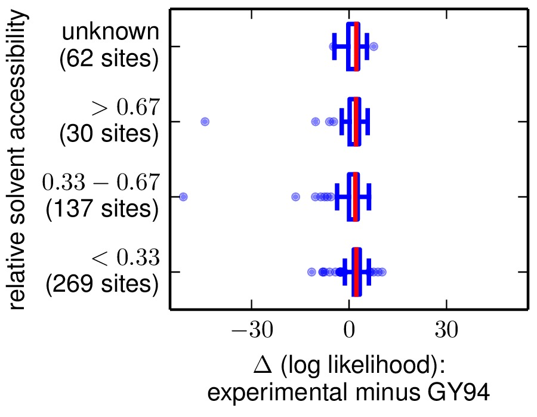

===============================================================
2014 analysis of influenza NP with stringency parameter
===============================================================

.. contents::
   :depth: 3

Overview
------------
This is a description of an analysis of the effectiveness of experimentally determined substitution models for describing the evolution of influenza nucleoprotein (NP). 

This analysis closely parallels the one that has been previously described
in the paper `An experimentally determined evolutionary model dramatically improves phylogenetic fit`_ and is available at http://jbloom.github.io/phyloExpCM/example_2013Analysis_Influenza_NP_Human_1918_Descended.html

It differs from that analysis primarily in its use of a stringency parameter :math:`\beta` for the amino-acid preferences, and in its site-specific analysis. The use of this stringency parameter and the results from the analysis are described in `An experimentally informed evolutionary model improves phylogenetic fit to divergent lactamase homologs`_.

This analysis was performed by `Jesse Bloom`_.

The overall approach is to use the `phyloExpCM`_ package to analyze a NP phylogeny using an experimentally derived substitution model from a `mapmuts analysis of the Aichi68 influenza NP from 2013`_, and to compare this model to various standard codon substitution models.

Much of the analysis itself is performed using `HYPHY`_, which is run by `phyloExpCM`_ using the scripts detailed in the `phyloExpCM documentation`_. 

The phylogenetic tree that is analyzed consists of human influenza lineages with their NPs directly descended from the 1918 virus, specifically:

    * H1N1 from 1918 to 1957, and again from 1977 to 2008 (seasonal H1N1).
        
    * H2N2 from 1957 to 1968.
                
    * H3N2 from 1968 to 2013.

The code, data, and results from the analysis are in the ``./examples/2014Analysis_Influenza_NP_Human_1918_Descended_withbeta/`` subdirectory in the main `phyloExpCM`_ package directory. This subdirectory contains all of the necessary input files (see `Input files`_) for running the analysis. It also contains a master script (``run_analysis.py``) that can be used to regenerate the analysis with the command::

    python run_analysis.py

provided that you have installed the software described in `Software used`_.

Software used
----------------
The analysis was performed using the following software on the Fred Hutchinson computer cluster using the following Linux distribution::

    Linux version 3.5.0-43-generic (buildd@roseapple) (gcc version 4.6.3 (Ubuntu/Linaro 4.6.3-1ubuntu5) ) #66~precise1-Ubuntu SMP Thu Oct 24 14:52:23 UTC 2013

In order to replicate the analysis, you will need to use Linux or Mac OS X, and install the software listed below.

The specific versions of software used are specified. Other versions will likely work as well, but this has not been confirmed.

* `Python`_ (version 2.7.3)

* `phyloExpCM`_ : specifically, `phyloExpCM version 0.3`_

* `numpy`_ (version 1.6.1)

* `matplotlib`_ (version 1.3.1).

* `mapmuts`_ : specifically, `mapmuts version 1.0`_

* `EMBOSS needle`_ (version 6.6.0). The executable with the name ``needle`` is expected to be in the current search path.

* `RAxML`_ (version 7.7.6). The executable with the name ``raxmlHPC-SSE3`` is expected to be in the current search path. This is the SSE3 version, and was built using the command::

    make -f Makefile.SSE3.gcc

  and then copying the executable into the search path.

* `Path-O-Gen`_ (version 1.4) was used for the visual identification of outliers from the molecular clock and to root trees based on date-stamping.

* `FigTree`_ (version 1.4.0) was used to open tree files for annotation, visualization, and saving of images.

* `codonPhyML`_ (version 1.00 201306.18) was used to build phylogenetic trees. The executable with the name ``codonphyml`` is expected to be in the current search path. This executable was compiled with the *omp* options to make it multi-threaded.

* `HYPHY`_ (version HYPHY 2.220131214beta(MP) for Linux on x86_64) was used to optimize the branches and compute the likelihoods under the different models. The multiprocessor (``HYPHYMP``) version of the executable was used. To install this, the following commands were run in the unzipped `HYPHY`_ source code directory after download::

    cmake -DINSTALL_PREFIX=/home/jbloom/.local/ .
    make MP2
    make install

* This analysis was run on the FHCRC scientific computing cluster using `sbatch`_ (version 2.6.2), and requires `sbatch`_ to be installed to run as currently implemented. If you don't want to use `sbatch`_, all you need to do is modify the main ``run_analysis.py`` script to not submit any jobs via `sbatch`_. The use of `sbatch`_ in the current version simply allows more processors to be used simultaneously and so speeds up the analysis.

* `ImageMagick convert`_ 6.6.9-7 2012-08-17 was used to convert PDF files to JPGs.

Input files
-----------------------
Here are the input files that are necessary to repeat the analysis. These are the names assigned with the ``./examples/2013Analysis_Influenza_NP_Human_1918_Descended/`` subdirectory of the main `phyloExpCM`_ package.

* ``run_analysis.py`` is a `Python`_ script that will perform the analysis assuming that you have all of the appropriate software (see `Software used`_) and input files. To run this script, use::

    python run_analysis.py

  at the command line. 

* *NPseqs.fasta* is the set of all unique full-length influenza A coding DNA sequences as downloaded from the `Influenza Virus Resource`_ on June-25-2013.

* *Aichi68-NP.fasta* is the coding DNA sequence for A/Aichi/2/1968 (H3N2) NP as taken from reverse-genetics plasmid pHWAichi68-NP.

* *JVI_82_8947_Anomalies.txt* is a list of the strain names for the sequences identified as anomalous (either frozen in time or recombinant) in Appendices 1 and 2 of `Krasnitz et al, 2008`.

* *JDB_Anomalies.txt* is a list of strain names that appear to be anomalous based on their strong violation of the molecular clock. These sequences are probably mis-annotated in the database, come from non-standard lineages (for examples a swine H3N2 isolated from humans), are reassortants (example would be an H1N1 NP that reassorted into an H3N2), or are extensively lab adapted and so deviate from the molecular clock due to large numbers ofadaptation mutations.

* *mutspectrum.txt* is a file that contains the experimentally measured nucleotide mutation rates. The measurement of these mutation rates is described in `An experimentally determined evolutionary model dramatically improves phylogenetic fit`_.

* File giving the inferred equilibrium amino-acid preferences at each site in NP. This file is from the `mapmuts analysis of the Aichi68 influenza NP from 2013`_. The file is ``p1_equilibriumpreferences.txt``. It is the combined experimental data from the two passage 1 replicates described in `An experimentally determined evolutionary model dramatically improves phylogenetic fit`_.

* ``./DSSP_analysis/`` is a subdirectory that contains the results of analyzing the solvent accessibilities and secondary structures of NP from the crystal structure. Briefly, the NP crystal structure in `PDB 2IQH`_ was downloaded, and the ``2IQH.pdb`` file was manually edited to extract only monomer C into ``2IQH_monomerC.pdb``. This monomer was then analyzed with the `DSSP webserver`_ to create the results stored in ``2IQH_monomerC.dssp``.

Running the analysis
-----------------------
The analysis in this directory can be repeated simply by running the master script ``run_analysis.py`` from the command line with::

    python run_analysis.py

or running it using `sbatch`_ with::

    sbatch run_analysis.sbatch

Other than the files delineated under `Input files`_, all data files in this directory can be re-generated with this command. However, the analysis approach does involve a few manual steps with `Path-O-Gen`_ and `FigTree`_ to create nicely formatted and annotated tree images from the raw tree files produced by the script. These manual steps are indicated below.

There is a variable called *use_existing_output* that is hardcoded into the beginning of this script. This variable is currently set to *True*, which means that if output already exists it is **not** overwritten and regenerated. If you want to regenerate the output (such as after changing input files or altering analysis parameters), then either manually delete the old output or change *use_existing_output* to *False* to force the script to overwrite old output. This script does **not** automatically test for dependencies among files, so if you change a file but keep *use_existing_output* to *True*, then you need to manually remove any old files with dependencies.

Note that ``run_analysis.py`` uses multiple CPUs to speed up some of the analyses. If you don't have as many CPUs on your system, you might want to check that you are not overloading the system -- you can avoid this by using fewer CPUs, which will require you to manually modify the ``run_analysis.py`` script.

Note that ``run_analysis.py`` uses `sbatch`_ by default to run some of its subsidiary programs -- if you don't want to do this, set the *use_sbatch* option to *False* within the program.

Steps in the analysis
---------------------------------------
Here are the steps in the analysis. The command for each step is shown, but these commands (with the exception of some manual formatting of tree images with `Path-O-Gen`_ and `FigTree`_) are run automatically by the main ``run_analysis.py`` script if you are using that.

Creation of sequence alignments
~~~~~~~~~~~~~~~~~~~~~~~~~~~~~~~~
Extract and align the human NP sequences descended from the 1918 virus into *Aligned_NPs.fasta*. This is done by the script ``get_treeseqs.py``, by running::

    python get_treeseqs.py

The created *Aligned_NPs.fasta* includes the sequences with headers that give their isolation date (except for H1N1 from after 1977, where 24 years are subtracted from the isolation date for the reasons described below).

The specific steps are as follows:

1) Read all sequences from *NPseqs.fasta*.

2) Purge any sequences specified as anomalous in *JVI_82_8947_Anomalies.txt* and *JDB_Anomalies.txt*.

3) Purge any sequences with ambiguous nucleotide identities.

4) If there are redundant identical sequences, keep only one sequence from each set of identical sequences.

5) Purge any sequences for which the host, year of isolation, or subtype is unavailable.

6) Purge any sequences for which the host is something other than human.

7) Keep at most 3 sequences per year from each of the following classifications. Sequences from other classifications are all removed. The classifications for which 3 per year are retained are:

    * H1N1 from 1918 to 1957: this is H1N1 directly descended from the 1918 virus.

    * H2N2 from 1957 to 1968: this H2N2 derived from reassortment of an avian virus with the existing H1N1 in the 1957 "Asian flu" pandemic. The NP in the new H2N2 was from the existing H1N1, which then went extinct.

    * H3N2 from 1968 to 2013: this is H3N2 derived from reassortment of an avian virus with thte existing H2N2 in the 1968 "Hong Kong flu" pandemic. The NP in the new H3N2 was from the existing H2N2, when then went extinct.

    * H1N1 from 1977 to 2008: this is "seasonal H1N1" that arose in 1977 in the "Russian flu" pandemic. This is a virus from the earlier human H1N1 that was frozen and re-released. The virus was frozen for about 24 years before this pandemic (estimate from `dos Reis et al, 2009`_), and therefore **24 years are subtracted from the isolation date of viruses in this lineage**. This date subtraction is not important for the construction of the phylogenetic tree, but it is important for the `Path-O-Gen`_ based analysis that assumes a molecular clock (see `Check for outlier sequences`_).

8) Translate and align all of the protein sequences, then also construct nucleotide alignments from the protein alignments. The alignments are built with `EMBOSS needle`_. The alignments are written to *Aligned_NPs.fasta* and *Aligned_NP_proteins.fasta*.

Check for outlier sequences
~~~~~~~~~~~~~~~~~~~~~~~~~~~~~
There are almost always clear "outlier" sequences in influenza phylogenies. These outliers can arise from several sources:

    * Mis-annotation of the date or subtype in the database.

    * Amplification of a lab contaminant during sequencing.

    * Sequencing of a zoonotic rather than epidemic strain. For example, there are currently low rates of swine-origin vH3N2 in humans. These strains are also sequenced and labeld as human H3N2 (since they are H3N2 from humans) -- but they are not from the same evolutionary lineage, as they have been evolving in swine.

To eliminate such outliers, several steps were taken. First, sequences that have already been identified as anomalous `Krasnitz et al, 2008`_ are eliminated in `Creation of sequence alignments`_ described above.

However, to identify further outliers, the following steps were taken. Essentially, these steps utilize `RAxML`_ and `Path-O-Gen`_ to manually identify sequences that are clear outliers from the molecular clock. These sequences are then added to the file *JDB_Anomalies*, and the steps in `Creation of sequence alignments`_ and then those here are repeated. This iterative process has been completed for the sequences here until no more outliers were identified.

Specifically, the steps were:

1) The ``run_analysis.py`` script builds a `RAxML`_ tree for quick visual inspection. `RAxML`_ is used because it is a rapid method to build a reasonable maximum-likelihood tree. The steps:

    a) The subdirectory ``./RAxML_output/`` was created

    b) `RAxML`_ was run using the following command:: 

        raxmlHPC-SSE3 -w ./RAxML_output -n Aligned_NPs -p 1 -m GTRCAT -s Aligned_NPs.fasta

       Note that for the actual command, the full path needs to be specified for the ``RAxML_output`` subdirectory as `RAxML`_ does not handle relative paths -- this is handled by the master script ``run_analysis.py``.

    c) The following command will have created the best `RAxML`_ tree as ``./RAxML_output/RAxML_bestTree.Aligned_NPs``. 
    
2) The next step is manual. Open this tree using `Path-O-Gen`_, and look manually to see if there are outliers from the molecular clock in the ``./RAxML_output/RAxML_bestTree.Aligned_NPs`` file. If so, add these outliers to *JDB_Anomalies.txt* and repeat the `Creation of sequence alignments`_ and this `RAxML`_ analysis. Note that this has already been done, so if you are just re-running the analysis then you don't need to do this unless you have changed the sequence set.

Construction of phylogenetic tree
~~~~~~~~~~~~~~~~~~~~~~~~~~~~~~~~~~~~~~~~~~~~~~~~~~~~~~~~
A high-quality phylogenetic trees were then constructed using `codonPhyML`_, which is able to build maximum-likelihood trees with codon substitution models. 

The `phyloExpCM`_ script ``phyloExpCM_runcodonPhyML.py`` (see `phyloExpCM documentation`_ for details) was used to run `codonPhyML`_. Trees were built using 
the *GY94* codon model (`Goldman and Yang 1994`_) with:
    
        - The equilibrium codon frequencies estimated emprically using the `CF3x4`_ method.

        - A single transition / transversion ratio (*kappa*) estimated by maximum likelihood.

        - The dN/dS ratio (*omega*) drawn from four discrete gamma-distributed categories (`Yang 1994`_) with the shape parameter and mean estimated by maximum likelihood.

The tree construction was performed in the ``./GY94_codonPhyML_tree/`` subdirectory. The tree itself is in the file ``./GY94_codonPhyML_tree/codonphyml_tree.newick``.

Optimizing the tree with various substitution models
~~~~~~~~~~~~~~~~~~~~~~~~~~~~~~~~~~~~~~~~~~~~~~~~~~~~~~
This is the heart of the analysis: to use various codon substitution models to optimize the branch lengths and likelihood for the tree topology estimated with `codonPhyML`_ and the *GY94* substitution model as described in `Construction of phylogenetic tree`_. This analysis compares the experimentally determined codon substitution models with various other substitution models.

This analysis is done with the `phyloExpCM`_ scripts ``phyloExpCM_ExpModelOptimizeHyphyTree.py`` and ``phyloExpCM_optimizeHyphyTree.py``, which are described in the `phyloExpCM documentation`_. These scripts uses `HYPHY`_ to optimize the branch lengths and any substitution model free parameters on the fixed tree topology estimated with `codonPhyML`_.

The results of the optimizations for the various substitution models are in the subdirectory ``./codonmodel_optimized_trees/``. Within this subdirectory are further subdirectories containing the results of optimizing the branch lengths with `HYPHY`_ using the indicated codon substitution models. For example, ``./codonmodel_optimized_trees/Tree-GY94_Model-KOSI07_F_omega-global-gamma4_rates-one/`` contains one such model. Within this subdirectory, the files of interest are:

    * ``hyphy_tree.newick`` or ``optimizedtree.newick`` (file name differs for different analyses) is the tree with branch lengths optimized by `HYPHY`_ using the substitution model in question.

    * ``hyphy_output.txt`` or ``optimizedtree_results.txt`` (file name differs for different analyses) is a text file summarizing the `HYPHY`_ output from the optimization. 

    * ``sitelikelihoods.txt`` gives the per-site likelihoods.

A more helpful way to view the results is to look at the main summary files created in the examples home directory. These files are ``GY94_summary.csv`` (for optimization of the tree topology estimated by `codonPhyML`_ with the *GY94* model) and a ``LaTex`` version of this file called ``GY94_summary.tex``.

Here are the results for optimization of the tree topology inferred with the *GY94* model in `codonPhyML`_ (this is the file ``GY94_summary.csv``):

    .. include:: example_2014Analysis_Influenza_NP_Human_1918_Descended_withbeta_GY94_summary.csv
       :literal:

These results show that inclusion of the stringency parameter :math:`\beta` improves the phylogenetic fit.

Comparison of per-site likelihoods
~~~~~~~~~~~~~~~~~~~~~~~~~~~~~~~~~~~~~~~~~
The `phyloExpCM` script ``phyloExpCM_SiteLikelihoodComparison.py`` was used to compare the per-site likelihoods between the best experimentally informed model (the *HalpernBruno* model with a fitted :math:`\beta`) and the best traditional model (the *GY94*
model with gamma-distributed rates and :math:`\omega`).
 
This was done by creating the input file ``phyloExpCM_SitelikelihoodComparison_infile.txt``
and then running::

     phyloExpCM_SiteLikelihoodComparison.py phyloExpCM_SiteLikelihoodComparison_infile.txt

This created three output files.

The first, ``sitelikelihoods.txt`` lists the differences in per-site likelihoods by site.
     
The next two are the following plots, which use Tukey box plots to show the differences in site likelihoods, categorizing sites by the `DSSP webserver`_ computed secondary
structures (*SS*) and relative solvent accessibilities (*RSA*) in ``DSSP_analysis/2IQH_monomerC.dssp``
Here are these plots:

.. figure:: example_2014Analysis_Influenza_NP_Human_1918_Descended_withbeta_sitelikelihoodcomparison_bySS.jpg   
   :width: 45%
   :align: center
   :alt: sitelikelihoodcomparison_bySS.jpg   
   
   The comparison of site likelihoods with sites categorized by secondary structure (``sitelikelihoodcomparison_bySS.pdf``).
   

   The comparison of site likelihoods with sites categorized by relative solvent accessibility (``sitelikelihoodcomparison_byRSA.pdf``).
                    

.. _`mapmuts`: https://github.com/jbloom/mapmuts
.. _`mapmuts analysis of the Aichi68 influenza NP from 2013`: http://jbloom.github.io/mapmuts/example_2013Analysis_Influenza_NP_Aichi68.html
.. _`mapmuts documentation`: http://jbloom.github.io/mapmuts/
.. _`Influenza Virus Resource`: http://www.ncbi.nlm.nih.gov/genomes/FLU/FLU.html
.. _`EMBOSS needle`: http://emboss.sourceforge.net/download/
.. _`Krasnitz et al, 2008`: http://jvi.asm.org/content/82/17/8947.abstract
.. _`ImageMagick convert` : http://www.imagemagick.org/script/convert.php
.. _`BEAST`: http://beast.bio.ed.ac.uk/Main_Page
.. _`dos Reis et al, 2009`: http://www.ncbi.nlm.nih.gov/pubmed/19787384
.. _`TreeAnnotator`: http://beast.bio.ed.ac.uk/TreeAnnotator
.. _`FigTree`: http://tree.bio.ed.ac.uk/software/figtree/
.. _`RAxML`: https://github.com/stamatak/standard-RAxML
.. _`Path-O-Gen`: http://tree.bio.ed.ac.uk/software/pathogen/
.. _`phyloExpCM`: https://github.com/jbloom/phyloExpCM
.. _`on GitHub`: https://github.com/jbloom/phyloExpCM
.. _`phyloExpCM documentation`: http://jbloom.github.io/phyloExpCM
.. _`codonPhyML`: http://sourceforge.net/projects/codonphyml/
.. _`Python`: http://www.python.org/
.. _`sbatch`: https://computing.llnl.gov/linux/slurm/sbatch.html
.. _`CF3x4`: http://www.plosone.org/article/info%3Adoi/10.1371/journal.pone.0011230
.. _`Goldman and Yang 1994`: http://mbe.oxfordjournals.org/content/11/5/725.full.pdf
.. _`Yang 1994`: http://www.ncbi.nlm.nih.gov/pubmed/7932792
.. _`Kosiol et al, 2007`: http://www.ncbi.nlm.nih.gov/pubmed/17400572
.. _`HYPHY`: http://www.hyphy.org/w/index.php/Main_Page
.. _`Jesse Bloom`: http://research.fhcrc.org/bloom/en.html
.. _`PDB 2IQH`: http://www.rcsb.org/pdb/explore.do?structureId=2iqh
.. _`DSSP webserver`: http://www.cmbi.ru.nl/hsspsoap/
.. _`AIC`: http://en.wikipedia.org/wiki/Akaike_information_criterion
.. _`numpy`: http://www.numpy.org/
.. _`matplotlib`: http://matplotlib.org/
.. _`An experimentally determined evolutionary model dramatically improves phylogenetic fit`: http://mbe.oxfordjournals.org/content/31/8/1956
.. _`phyloExpCM version 0.3`: https://github.com/jbloom/phyloExpCM/tree/v0.3
.. _`mapmuts version 1.0`: https://github.com/jbloom/mapmuts/tree/v1.0
.. _`An experimentally informed evolutionary model improves phylogenetic fit to divergent lactamase homologs`: http://dx.doi.org/10.1093/molbev/msu220
