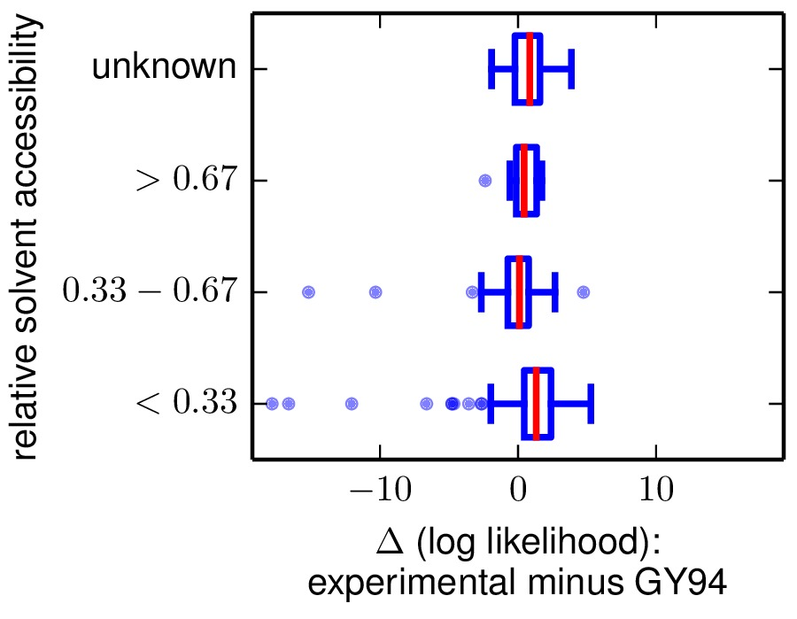
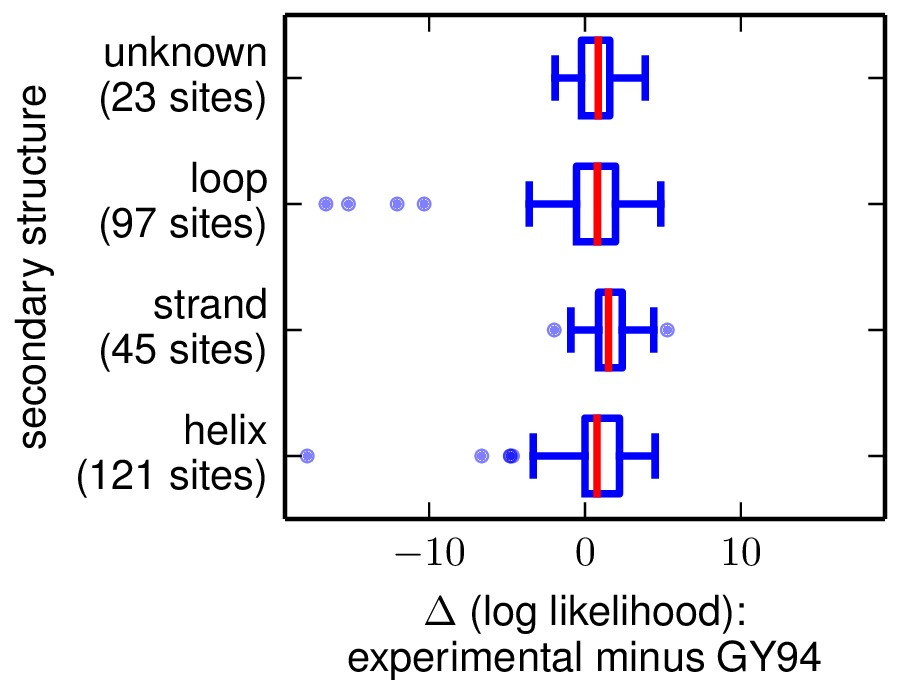

.. _phyloExpCM_SiteLikelihoodComparison.py:

========================================
phyloExpCM_SiteLikelihoodComparison.py
========================================

This simple script is designed to compare per-site likelihoods computed with two different substitution models. This is useful if you would like to determine which sites (or types of sites) are described better by one model versus another.

Typically, the per-site likelihoods are listed in files such as those created by running the `phyloExpCM`_ scripts :ref:`phyloExpCM_ExpModelOptimizeHyphyTree.py` or :ref:`phyloExpCM_optimizeHyphyTree.py` with the *persitelikelihoods* option.

You can optionally compare the per-site likelihood performance to site classifications based on relative solvent accessibility (RSA) or secondary structure computed using `DSSP`_. This will require you to have a crystal structure for your protein that you can analyze with `DSSP`_.

This script requires `mapmuts`_ and `matplotlib`_.

To run the script, create an input file of the format described below. Then run the script followed by the input file, as in::

    phyloExpCM_SiteLikelihoodComparison.py infile.txt

Format of the input file
----------------------------
The input file specifies `key` / `value` pairs on individual lines in the format::

    key1 value1
    key2 value2
    
Blank lines or lines
that begin with # are ignored (i.e. as comment lines). 

The input file should contain the following keys:

* *sitelikelihoodfiles* : This key should be followed by the names of two existing files listing the per-site likelihoods for all sites in the gene. The names of the files cannot contain spaces. The must list exactly the same sites. Typically, these are the files created with the *persitelikelihoods* option of :ref:`phyloExpCM_ExpModelOptimizeHyphyTree.py` or :ref:`phyloExpCM_optimizeHyphyTree.py`. Here is an example of the format (the first line is a header, all other lines list sites and then likelihoods)::

            #SITE   SITE_LOG_LIKELIHOODS
            1   -4.792906363107919
            2   -15.89808216031635
            3   -17.19022748421175

* *modelnames* : This should be the names of the two models using to produce the two files specified by *sitelikelihoodsfiles*. These names cannot contain spaces, but they can contain underscores which are converted to spaces in the displayed results.

* *outfileprefix* : The prefix of the output files created by this script (see `Output files`_). Set to *None* if you don't want any prefix and just want the base names described in `Output files`_.

* *dsspfile* : is an option that allows you to compare the observed site entropies and preferences to the relative solvent accessibility (RSA) and the secondary structure for the sites. This will only be useful if a crystal structure for your protein is available. You can then use the `DSSP`_ webserver to calculate the secondary structures and the RSAs. If you do not want to use this option, just set *dsspfile* to *None*. If you do want to use this option, then run `DSSP`_ on your protein structure – this script is tested against output from the `DSSP`_ webserver, but should probably work on output from the standalone too. Then save the `DSSP`_ output in a text file, and specify the path to that file as the value for *dsspfile*. This script does not currently have a robust ability to parse the `DSSP`_ output, so you have to do some careful checks. In particular, you must make sure that residue numbers in the PDB file exactly match the residue numbering scheme used for the rest of this analysis (i.e. the same residue numbers found in sitepreferences, and that none of the residue numbers contain letter suffixes (such as 24A) as is sometimes the case in PDB files. It is not necessary that all of the residues be present in the PDB. If there are multiple PDB chains, you can specify them using the *dsspchain* option. `DSSP`_ only calculates absolute accessible surface areas (ASAs); the RSAs are computed by normalizing by the maximum ASAs given by `Tien et al, 2013`_.

* *dsspchain* : is an option that is only meaningful if *dsspfile* is set to a value other than *None*. In this case, it should specify the chain in the PDB file that we want to use. If there is only one chain, you can set this option to *None*.

Example input file
---------------------------
Here is an example input file::

    # input file for running script phyloExpCM_SiteLikelihoodComparison.py for phyloExpCM_SiteLikelihoodComparison
    sitelikelihoodfiles codonmodel_optimized_trees/Tree-GY94_Model-fitbetaHalpernBruno/sitelikelihoods.txt codonmodel_optimized_trees/Tree-GY94_Model-GY94_CF3x4_omega-global-gamma4_rates-gamma4/sitelikelihoods.txt
    modelnames experimental GY94
    dsspfile 1XPB_renumbered.dssp
    dsspchain None
    outfileprefix None

Output files
----------------

The output of this script is two PDF plots and a text file. These files give the site likelihood computed by model 1 (the first entry in *sitelikelihoodsfiles* and *modelnames*) minus the site likelihood computed by model 2 (the second entry in *sitelikelhoodsfiles* and *modelnames*).

These files all have the prefix specified by *outfileprefix* followed by the following to suffixes:

    * ``sitelikelihoodcomparison_bySS.pdf`` : sites are categorized according to secondary structure in this PDF plot.

    * ``sitelikelihoodcomparison_byRSA.pdf`` : sites are categorized according to RSA (relative solvent accessibility) in this PDF plot.

    * ``sitelikelihoods.txt`` : text file listing per-site likelihoods and differences between them for the two models. These are sorted according to the differences in site likelihoods. Here are the first few lines of such a file::

        #SITE   experimental_likelihood_minus_GY94_likelihood   experimental_likelihood GY9    4_likelihood secondary_structure relative_solvent_accessibility
        33  -17.8153    -94.7358    -76.9205    helix   $< 0.33$
        236 -16.6144    -77.372     -60.7576    loop    $< 0.33$
        102 -15.1698    -75.4882    -60.3184    loop    $0.33 - 0.67$
        162 -12.0474    -102.512    -90.4646    loop    $< 0.33$
        237 -10.3165    -87.4672    -77.1507    loop    $0.33 - 0.67$

Here are examples of the two plots. The y-axis labels show the site category (top line of label) and the number of sites that fall into that category (bottom line of label).

   Example of the ``sitelikelihoodcomparison_byRSA.pdf`` plot.

   Example of the ``sitelikelihoodcomparison_bySS.pdf`` plot.

.. include:: weblinks.txt
